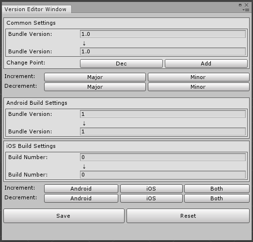

# Version Editor Window

Using this editor extension window, you can easily edit the Version, Build number, and Bundle Version Code of Unity Project.

## Install
1. Download latest version-editor-window_vX.X.X.unitypackage from this link.
https://github.com/Accky/VersionEditorWindow/releases
2. Import version-editor-window_vX.X.X.unitypackage to your project.

## Usage
- **Change Point button** 
   - [Dec]: Decrease Point. Min point is 1.
   - [Add]: Add Point. Max point is 5.
- **Increment for Common Settings**
   - [Major]: Increment Major version.
   - [Minor]: Increment Minor version.
   - [Point]: Increment Point version.
   - [MPoint]: Increment MPoint version.
   - [MMPoint]: Increment MMPoint version.
- **Decrement for Common Settings**
   - [Major]: Decrement Major version.
   - [Minor]: Decrement Minor version.
   - [Point]: Decrement Point version.
   - [MPoint]: Decrement MPoint version.
   - [MMPoint]: Decrement MMPoint version.
- **Increment for Bundle Version/Build Number**
   - [Android]: Increment Android Bundle Version.
   - [iOS]: Increment iOS Build Number.
   - [Both]: Increment Android Bundle Version & iOS Build Number.
- **Decrement for Bundle Version/Build Number**
   - [Android]: Decrement Android Bundle Version.
   - [iOS]: Decrement iOS Build Number.
   - [Both]: Decrement Android Bundle Version & iOS Build Number.
- **Reset button:** Reset all version info before edit.
- **Save button:** Save all version info to PlayerSettings.

## Operation confirmed
- Unity 2018.4.10f1
- Visual Studio 2019 Community